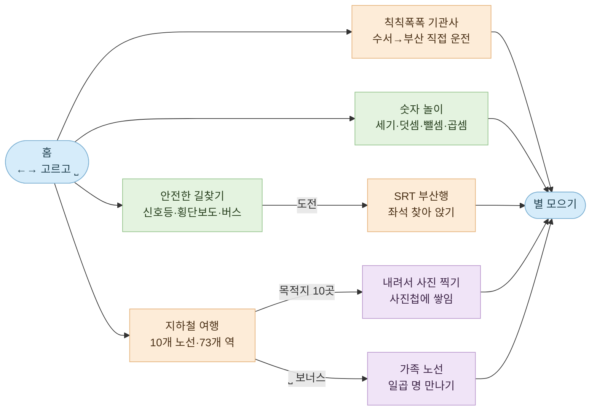

<div align="center">

# 숫자블록 미니게임

**숫자블록 친구들과 세고, 더하고, 길을 찾고, 지하철을 갈아타는 네다섯 살의 첫 웹 게임**

[](#아홉-가지-놀이)
[](#테스트)
[](#어떻게-만들어졌나)
[](#소리와-음성)
[](#지하철-안내방송-정리)
[](https://bliss-forge.github.io/numberblocks-minigame/)

**▶ [지금 놀아보기](https://bliss-forge.github.io/numberblocks-minigame/)**

</div>

> [!IMPORTANT]
> 이 게임은 **네 살에서 여섯 살 아이가 혼자 조작한다**는 전제로 만들어졌습니다.
> 방향키와 스페이스바, 그리고 답을 쓸 때의 숫자키만으로 전부 조작되고, 틀려도 벌점이나 실패 화면이 없습니다.
> 화면을 고칠 때 이 두 가지는 깨뜨리지 않아야 합니다.

---

## 빠른 시작

빌드도 설치도 없습니다. 정적 파일이라 아무 정적 서버에나 얹으면 됩니다.

```bash
git clone https://github.com/bliss-forge/numberblocks-minigame.git
cd numberblocks-minigame

python3 -m http.server 8000     # 아무 정적 서버나 괜찮습니다
open http://localhost:8000

npm test                        # 테스트 712개
```

`file://` 로 직접 열면 ES 모듈이 막히니 꼭 서버로 띄워 주세요.

---

## 아홉 가지 놀이

홈에서는 <kbd>←</kbd> <kbd>→</kbd> 로 카드를 옮겨 다니다 <kbd>⎵</kbd> 로 들어갑니다. 클릭·터치도 됩니다.
카드 번호와 캐릭터 번호는 항상 같습니다.

| 번호 | 놀이 | 하는 일 | 캐릭터 |
| --- | --- | --- | --- |
| 1 | **몇 개일까?** | 블록을 눈으로 세어 답합니다 | 1 |
| 2 | **더하기 합체** | 두 친구를 모아 하나로 만듭니다 | 2 |
| 3 | **빼기 블록** | 친구를 덜어내고 남은 수를 셉니다 | 3 |
| 4 | **곱하기 블록** | 줄과 칸을 세어 곱을 구합니다 | 4 |
| 5 | **안전한 길찾기** | 신호등과 차를 피해 친구를 만나러 갑니다 | 5 |
| 6 | **지하철 여행** | 노선을 갈아타며 목적지까지 갑니다 | 6 |
| 7 | **칙칙폭폭 기관사** | 직접 기차를 몰고 부산까지 갑니다 | 7 |
| 8 | **알록달록 물감 놀이** | 물감을 섞어 새 색을 만듭니다 | 8 |
| 9 | **택배 왔어요!** | 택배차를 몰고 문 앞까지 배달합니다 | 9 |

난이도는 쉬움 · 차근차근 · 도전 세 단계이고, 고른 값은 다음에 켤 때도 남습니다.



### 안전한 길찾기

옆에서 본 동네를 걸어 다니며 신호등을 보고 건너고, 버스를 타고, 친구를 만납니다.
지도는 쉬움·차근차근·도전 세 가지이고, **도전 지도만 SRT 부산행으로 이어집니다** —
수서에서 출발해 동탄·대전·대구를 지나 부산까지, 다섯 칸짜리 열차에서 자기 좌석을 찾아 앉는 여정입니다.

### 지하철 여행

서울 지하철을 옮겨 그린 노선도 위에서 실제로 갈아타며 목적지까지 갑니다.

| | |
| --- | --- |
| 노선 | 10개 (실제 1~9호선 + 가족 노선 10호선) |
| 역 | 73개, 이 중 환승역 28개 |
| 목적지 | 10곳 — 동물원·놀이공원·야구장·경복궁·남산타워·한강공원·하늘공원·어린이대공원·석촌호수·국회의사당 |
| 조작 | 방향키로 걷고, <kbd>Space</kbd>로 타고 내림 |

개찰구를 걸어 지나 계단을 내려가고, 승강장에서 열차를 기다렸다가, 노선도를 보며 내릴 역을 고릅니다.
창밖 풍경은 노선마다 다릅니다 — 1·9호선은 지상, 2·3·4호선은 한강을 건너고, 5~8호선은 지하를 달립니다.
환승역에서는 통로를 걸어 에스컬레이터로 다음 호선에 올라갑니다.
역 이름 안내는 **그 역에 실제로 섰을 때** 나오고, 목적지에서는 도착 멜로디에 이어 발빠짐 주의가 나옵니다.

#### 내릴 때 — 폴짝 뛰기

목적지에 서면 문이 열리고 막대기가 좌우로 움직입니다. 가운데 노란 칸에 왔을 때
<kbd>Space</kbd>를 누르면 승강장 틈을 폴짝 뛰어넘어 내립니다.
**갈아타는 역에서도 똑같이 폴짝 뛰어야 통로가 열립니다** — 다만 환승은 축하 음악 없이
문 열림 소리와 발빠짐 주의만 나오고 바로 시작합니다.
세 번 놓치면 네 번째는 그냥 건너가게 해 줍니다 — 이 놀이는 박자를 가르치지,
아이를 열차 안에 가두지 않습니다.

#### 도착해서 — 사진 찍기

내리면 그 장소가 펼쳐집니다. 방향키로 네모 프레임을 옮겨 주인공을 담고
<kbd>Space</kbd>를 누르면 찰칵 — 동물원이면 코끼리, 놀이공원이면 관람차,
야구장이면 전광판입니다. 찍은 곳은 화면 위 **사진첩**에 쌓이고 다음에 켜도 남습니다.

| | |
| --- | --- |
| 조준 | 5×3 칸으로 끊어 움직여 손이 미끄러지지 않습니다 |
| 안내 | 주인공이 어느 쪽인지 매번 알려 줍니다 |
| 벌점 | 없습니다. 세 번 빗나가면 네 번째는 그냥 찍힙니다 |

#### 10호선 가족 노선 — 보너스

서울에 10호선은 없습니다. 신도림에서 2호선과 만나 도시 남쪽으로 내려가는,
도하네 가족이 사는 노선입니다. 목적지 고르는 화면에서 <kbd>Space</kbd>로 들어갑니다.
숫자키 열 개는 목적지가 다 쓰고 있어서 스페이스바를 받았는데, 지하철에서 이미
타고 내릴 때 쓰는 키라 아이에게 새 규칙이 아닙니다.

```
신도림 ─ 엄마 ─ 아빠 ─ 고양 할아버지 ─ 고양 할머니 ─ 김해 할아버지 ─ 김해 할머니 ─ 도하
```

여정은 보통 지하철과 똑같습니다 — **환승 두 번**을 거쳐 도하네 집까지 찾아갑니다.
가족역들은 지나가며 이름만 보고, **마지막 도하역에서 여섯 분이 한꺼번에 마중 나옵니다.**
역마다 내렸다 타는 것은 지루해서 그만뒀습니다.

여섯 사람은 사진이 아니라 알아볼 만한 특징만 옮겨 그렸고, 사진 파일은
저장소에 넣지 않았습니다.

### 칙칙폭폭 기관사

오늘은 도하가 기관사입니다. SRT(자주색)나 KTX(파란색)를 골라 수서에서 부산까지 직접 몹니다.

| | |
| --- | --- |
| 조작 | ↑ 가속(놓아도 속도 유지) · ↓ 브레이크 · ⎵ 경적/딱 멈추기/태우기 · 1/3 뷰 전환 |
| 노선 | 수서 → 동탄 → 대전 → 대구 → 부산 (기존 SRT 게임과 같은 역, 같은 음성) |
| 뷰 | 1인칭 운전실(속도계·터널 실내등·속도 풍선) / 3인칭 바깥(열차·창문 승객) |
| 배경 | 하루의 여정 — 아침 도심 → 낮 들판·강 → 노을·밤 산·터널 → 새벽 바다 해돋이 |

SRT 실사 모션은 도심·들판·산·강·바다·터널의 **완성 장면 플레이트**를 그대로
사용합니다. 여러 사진을 이어 붙이거나 런타임에서 스티칭하지 않고, 장면 한 장 안에서
결정적으로 이동하는 배경·선로와 고정 열차/운전실 프레임을 겹칩니다. 역 진입 때만 별도의
승강장 플레이트를 보여 줍니다. 자산이나 브라우저 기능이 부족하면
`motion-ready → realistic-ready → fallback` 순서로 단계적으로 낮춰 기존 게임을 유지합니다.

가로 모바일에서는 나가는 교차 장면을 바로 내려 움직이는 큰 래스터를 장면·역·열차 또는
운전실의 최대 세 장으로 제한하고, 무거운 필터와 상시 GPU 힌트를 끕니다. 운영체제의
**동작 줄이기**가 켜져도 열차의 결정적 위치는 계속 갱신되지만 블러·진동·속도선·장면
교차와 보간 애니메이션은 즉시 멈춥니다.

역마다 넘버블럭스 친구들이 줄 서서 기다리고, ⎵ 한 번에 한 명씩 폴짝 타며 함께 셉니다
(역당 3~6명 + 매판 다른 게스트 + 30/50/70/100 큰 손님 1명). 정차는 노란 손바닥이 뜨면
⎵ — 마커에 가까울수록 별이 커집니다(⭐~⭐⭐⭐). 지나쳐도 "어이쿠~" 하고 통통 돌아올 뿐
벌점은 없고, 손을 떼고 있으면 게임이 힌트를 주다가 같이 몰아 줍니다. 네 정거장 모두
⭐⭐⭐면 **퍼펙트 기관사**입니다. 경적(⎵)은 어디서 울려도 세상이 답합니다 — 오리는
연타할수록 줄줄이, 터널은 메아리, 바다에선 갈매기 편대가 답례합니다.

---

## 소리와 음성

| 종류 | 내용 |
| --- | --- |
| 안내 음성 | 한국어 210개 · 영어 200개 (`assets/audio/voice/`) |
| 지하철 안내방송 | 실제 서울 지하철 도착 안내 62개 역 + 발빠짐 주의·출입문 예고·도착 멜로디 |
| 음소거 | 화면 오른쪽 위 **소리** 버튼 하나로 전부 끕니다 |

음성이 없는 역에서는 소리가 조용히 넘어가고 안내 문구만 뜹니다.
실제 역 중에서는 국회의사당 한 곳이 여기에 해당합니다 — 9호선 안내방송 묶음을 아직
구하지 못했습니다. 가족역 일곱 곳은 지어낸 역이라 안내방송을 아예 찾으러 가지 않습니다.

### 지하철 안내방송 정리

내려받은 안내방송 묶음을 `subway_sound/` 아래 게임이 찾는 이름으로 정리해 주는 도구가 있습니다.
CP949로 압축된 zip을 그대로 넣어도 되고, 한 역에 여러 녹음이 있으면 한국어 도착 안내 중 가장 짧은 것을 고릅니다.

```bash
node scripts/import_station_sounds.mjs subway_sound/original_subway_sound            # 미리보기
node scripts/import_station_sounds.mjs subway_sound/original_subway_sound --apply    # 실제 정리
```

출발·행선 안내와 외국어 안내는 도착 음성이 아니라서 걸러내고, 옮길 때 64kbps 모노로 다시 인코딩합니다.
원본을 그대로 넣으려면 `--raw` 를 붙이면 됩니다.

---

## 어떻게 만들어졌나

런타임 의존성이 없습니다. 브라우저가 바로 읽는 ES 모듈과 CSS, 인라인 SVG가 기본이고,
7번 **칙칙폭폭 기관사**만 저장소에서 직접 만든 WebP 장면 레이어를 사용합니다. WebP를 불러오지
못하면 기존 SVG 열차·풍경으로 자동 복귀하며, 빌드 단계 없는 정적 배포 방식은 그대로입니다.
캐릭터는 미리 렌더한 PNG를 쓰고, 지하철 승강장·동네 골목·도착지 열 곳은 코드가 그립니다.

<details>
<summary><b>파일 구성</b></summary>

```
index.html                  홈 카드와 화면 뼈대
styles.css                  홈·게임 전체 시각 스타일
src/
  app.mjs                   게임 상태와 입력 처리
  game-model.mjs            문제 생성과 채점
  audio-manager.mjs         음성·효과음 재생과 음소거
  audio-manifest.mjs        음성 키 목록
  character-*.mjs           숫자블록 캐릭터 배치와 배율
  safety-route-*.mjs        안전한 길찾기 — 지도·이동·신호등·미니맵·그림
  srt-journey*.mjs          SRT 부산행 — 좌석 찾기와 열차 그림
  subway-*.mjs              지하철 여행 — 노선도·여정·장면·역 그림·도착지 그림
  family-line-art.mjs       가족 노선에 나오는 여섯 사람
  photo-hunt.mjs            도착지 사진 찍기와 사진첩
  station-sound-import.mjs  안내방송 파일명 해석
assets/
  characters/               숫자블록 캐릭터 161장
  train-realistic/           7번 게임 실사형 SRT 외부·운전실 WebP 장면
  audio/voice/{ko,en}/      안내 음성
subway_sound/               실제 지하철 안내방송
scripts/                    캐릭터 렌더·음성 생성·안내방송 정리
tests/                      테스트 41개 파일
docs/                       설계 문서와 작업 계획
```

</details>

### 아이가 쓰는 화면이라 지키는 것들

- 방향키·스페이스바로 다 고르고, 숫자키는 답을 쓸 때만 씁니다. 마우스가 없어도 됩니다.
- 모든 버튼은 최소 44×44px이고, 가로 모바일 기관사 조작부는 최소 48×48px이며 포커스 테두리가 뚜렷합니다.
- `prefers-reduced-motion`을 켜면 위치 진행은 유지하면서 실사 블러·진동·속도선·장면 교차가 멈춥니다.
- 오답에 벌점이 없습니다. 다시 해 보라고만 말합니다.
- PC 1280×720에서 카드 일곱 장이 5열 두 줄로 한눈에 들어오고, 모바일 390×844에서 가로 스크롤이 없습니다.

---

## 테스트

```bash
npm test        # node --test tests/*.test.mjs
```

브라우저 없이 도는 순수 노드 테스트입니다. DOM이 필요한 곳은 가짜 엘리먼트로 대신합니다.
문제 생성과 채점, 안전길 이동과 신호등, 지하철 경로와 환승, 장면 렌더 계약, 홈 카드 계약,
반응형 스타일, 음성 자산 존재 여부까지 **712개**가 확인합니다.

---

## 배포

`main`에 올라가면 GitHub Pages가 그대로 서빙합니다 — 빌드 단계가 없습니다.

**https://bliss-forge.github.io/numberblocks-minigame/**
